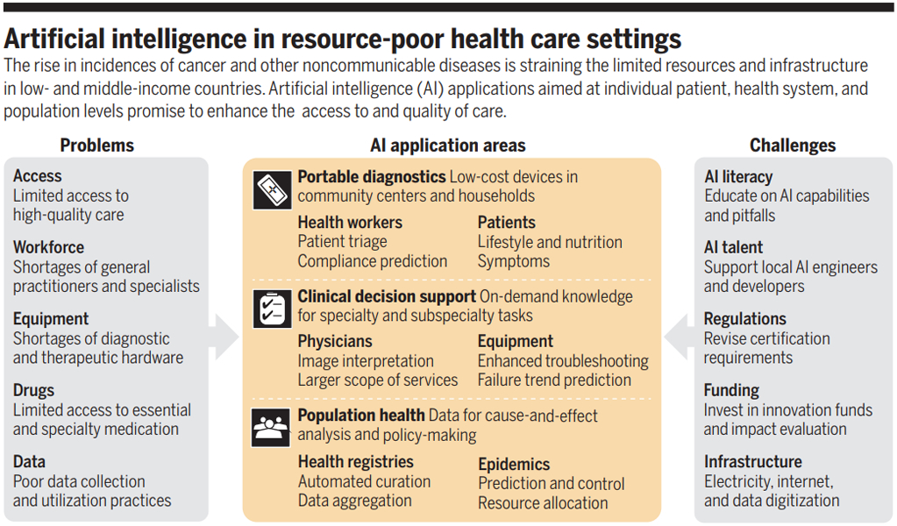
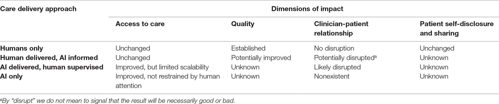

## The List of Paper

### Rajpurkar, P., Chen, E., Banerjee, O. & Topol, E. J. AI in health and medicine. Nat. Med. 28, 31–38 

doi: 10.1038/s41591-021-01614-0

> Artificial intelligence (AI) is poised to broadly reshape medicine, potentially improving the experiences of both clinicians and patients. We discuss key findings from a 2-year weekly effort to track and share key developments in medical AI. We cover prospective studies and advances in medical image analysis, which have reduced the gap between research and deployment. We also address several promising avenues for novel medical AI research, including non-image data sources, unconventional problem formulations and human-AI collaboration. Finally, we consider serious technical and ethical challenges in issues spanning from data scarcity to racial bias. As these challenges are addressed, AI's potential may be realized, making healthcare more accurate, efficient and accessible for patients worldwide.

### (2022). 2. Hosny, A. & Aerts, H. J. Artificial intelligence for global health. Science 366, 955–956 (2019).

doi: 10.1126/science.aay5189

> Not surprisingly, most AI developments in health care cater to the needs of high-income countries (HICs), where the majority of research is conducted. Conversely, little is discussed about what AI can bring to medical practice in low- and middle-income countries (LMICs), where workforce shortages and limited resources constrain the access to and quality of care. AI could play an important role in addressing global health care inequities at the individual patient, health system, and population levels. However, challenges in developing and implementing AI applications must be addressed ahead of widespread adoption and measurable impact.

### Cai, C. J., Winter, S., Steiner, D., Wilcox, L. & Terry, M. “hello AI”: Uncovering the onboarding needs of medical practitioners for Human-AI collaborative Decision-Making. Proc. ACM Hum.-Comput. Interact. 3 (2019).

doi: https://doi.org/10.1145/3359206

**Abstract**

>Although rapid advances in machine learning have made it increasingly applicable to expert decision-making, the delivery of accurate algorithmic predictions alone is insufficient for effective human-AI collaboration. In this work, we investigate the key types of information medical experts desire when they are first introduced to a diagnostic AI assistant. In a qualitative lab study, we interviewed 21 pathologists before, during, and after being presented deep neural network (DNN) predictions for prostate cancer diagnosis, to learn the types of information that they desired about the AI assistant. Our findings reveal that, far beyond understanding the local, case-specific reasoning behind any model decision, clinicians desired upfront information about basic, global properties of the model, such as its known strengths and limitations, its subjective point-of-view, and its overall design objective--what it's designed to be optimized for. Participants compared these information needs to the collaborative mental models they develop of their medical colleagues when seeking a second opinion: the medical perspectives and standards that those colleagues embody, and the compatibility of those perspectives with their own diagnostic patterns. These findings broaden and enrich discussions surrounding AI transparency for collaborative decision-making, providing a richer understanding of what experts find important in their introduction to AI assistants before integrating them into routine practice.

### Miner, A. S. et al. Key considerations for incorporating conversational AI in psychotherapy. Front. Psychiatry 10, 746 (2019).

doi: https://doi.org/10.3389/fpsyt.2019.00746

> Conversational artificial intelligence (AI) is changing the way mental health care is delivered. By gathering diagnostic information, facilitating treatment, and reviewing clinician behavior, conversational AI is poised to impact traditional approaches to delivering psychotherapy. While this transition is not disconnected from existing professional services, specific formulations of clinician-AI collaboration and migration paths between forms remain vague. In this viewpoint, we introduce four approaches to AI-human integration in mental health service delivery. To inform future research and policy, these four approaches are addressed through four dimensions of impact: access to care, quality, clinician-patient relationship, and patient self-disclosure and sharing. Although many research questions are yet to be investigated, we view safety, trust, and oversight as crucial first steps. If conversational AI isn’t safe it should not be used, and if it isn’t trusted, it won’t be. In order to assess safety, trust, interfaces, procedures, and system level workflows, oversight and collaboration is needed between AI systems, patients, clinicians, and administrators.

Daws, R. Medical chatbot using OpenAI’s GPT-3 told a fake patient to kill themselves. https://artificialintelligence-news.com/2020/10/28/medical-chatbot-openai-gpt3-patient-killthemselves/ (2020). Accessed: 2022-1-25.

