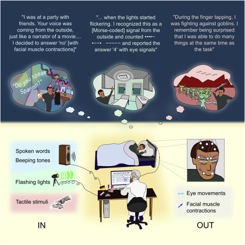
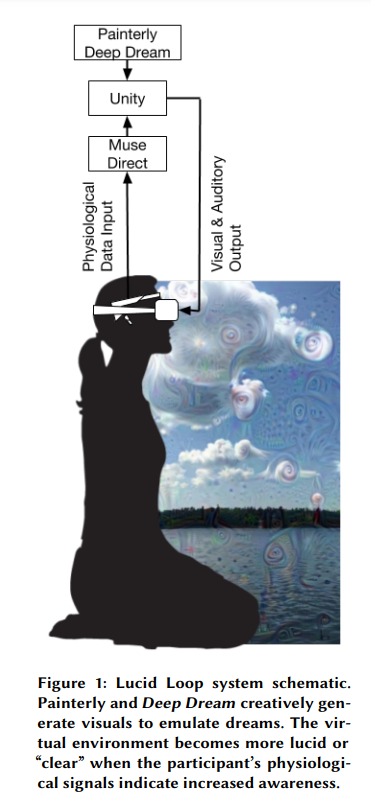

## Lucid Dream

### Are You Dreaming?: A Phenomenological Study on Understanding Lucid Dreams as a Tool for Introspection in Virtual Reality

doi: https://doi.org/10.1145/3173574.3173917

**Abstract**
> The ultimate VR might look like lucid dreaming, the phenomenon of knowing one is dreaming while in the dream. 

> Lucid dreaming can be used as an introspective tool and, ultimately, increase mental well-being. What these introspective experiences are like for lucid dreamers might be key in determining specific design guidelines for future creation of a technological tool used for helping people examine their own thoughts and emotions.

**Questions**
> What  are  people’s  experiences  of introspection in lucid dreaming?

> Sub-questions: 
> 1.  What  images,  sounds,  and  other  sensory  stimuli  are present during moments of introspection in lucid dreaming? 
> 2.  What  are  their  relationships  to  the  “feeling  tone”  and intensity of the emotional stimuli? 
> 3.  How  might  these  experiences  inform  the  design  of  an immersive virtual reality introspective experience? 
> More recently, technological  advances  have allowed  researchers to record lucid dreaming with EEG, EMG, EOG, and fMRI.

**Some interesting samples**
1. One participant, P9, recounted a lucid dream in  which they  attempted  to push  the limits of what was possible in a lucid dream by counting down from ten in order to “go  deeper” in the  lucid dream.  What they found was a dream scene of greater perceived   “realness”. The “realness” of the dream within a dream seemed to truly stay with  this participant because, as they explained,  it  felt like  a  deeper  level  of  being.  Going  even  deeper,  this participant  found  themselves  in  a  dream  scene  of  blood, gore, and  violence, which they  interpreted as going deeper into  sub  consciousness  to  the  more  primitive  parts  of human  nature. It  appears  that  exploring both  physical  and conceptual spaces is a large  part of the  experience of lucid dreaming for these participants. 
2. For a  few participants, it was common to  have  nightmares.  But  rather  than  become  frightened, they  became lucid  and  realized they  could  take  control of the  situation  to  either  escape  or  make  it  into  a  less frightening  scene.  There  was  a  confrontation  with  the dream space itself, and a conscious decision to change their own mind into a more positive state: “I  think  it  was  a  couple  years  ago  it  was  a  zombie dream.  I  was  watching  a  lot  of  Walking  Dead,  so  it started  off  as a nightmare  and  then it  became kind  of fun. I realized that I could hover above it and I wasn't in danger  and  I  could  kind  of  watch  it  as  if  it  was happening – like sometimes the dreams turn into kind of like  I'm  watching  a  movie  or  something.  It's entertaining and I don't want to wake up.” –P4 
3. Sometimes,  though,  diving  into  the depths  of  one’s  mind  revealed  some fairly surprising  and frightening aspects.  A few  participants  ventured to  go into the deeper parts  of their mind.  P1 described a dream space that they called “the field”, which was an electrical field of energy  that  sent  dreadful,  terrible  sensations  down  their spine.  P2  was  in  a  lucid  dream  and  wanted  to  meditate, which  to  them  meant  getting  rid  of  the  entire  external environment  and  focusing  on  themselves.  However,  this proved to be a  very  intense experience  because  it  felt  too black, too isolating, and too quiet. To be completely  alone with the self is not really something most of us experience, and so when P2 encountered that it was too much to handle at the time.  P9 also experienced a very  intense lucid dream where  they  wanted  to  go  deeper  into  their mind, like  the dream  within  a  dream  idea  popularized  by  the  movie Inception: “All  around  me  was  a  lot  of  blood  and  gore  and violence…  my  theory  was  that  because  I  went  a  lot deeper  into  the  subconscious  it was sort  of like I  saw more primal parts of human nature and that was all the blood, gore and violence.” –P9
> VR design suggestions
> 1. the strong focus on graphical  quality  in  VR  is  perhaps  not  as  important  as previously thought
> 2. accuracy of  the environment  does  not  seem  to  be  necessary  for  the feeling  of  realness 
> 3. a  realistic experience is no longer immersive VR’s sole goal
> 4. reliable brain  computer interfaces  combined  with VR, to mimic the randomness brought by thought
> 5. VR designers might also think about what ceremonies or preparations  the  users  are  undergoing  in  order  to  prepare for  them  for the  virtual  world

&nbsp;

### Real-time dialogue between experimenters and dreamers during REM sleep

doi: https://doi.org/10.1016/j.cub.2021.01.026

> In each case, REM sleep was verified with standard polysomnographic methods, and sensory stimulation was used to convey questions to the dreaming participant. Many participants first produced a pre-arranged ocular response (a series of left-right eye signals) to indicate that they were experiencing a lucid dream. Importantly, our procedures involved training prior to sleep with the same type of sensory stimulation used during sleep. We also included training with response methods. 
> Lucid dreamers were able to follow instructions to compute mathematical operations, answer yes-or-no questions, or discriminate stimuli in the visual, tactile, and auditory modalities. They were able to respond using volitional control of gaze direction or of different facial muscles.

>IN (lower left) refers to methods whereby information was transmitted from experimenter to dreamer. OUT (lower right) refers to methods whereby information was transmitted from dreamer to experimenter. Examples of three dreams (color-coded for each input method) are illustrated below relevant excerpts from corresponding dream reports obtained following awakening. 
> Data in Figure 2 were obtained from a 19-year-old American participant who reported experiencing only two lucid dreams previously. He received sound cues during a 90-min daytime nap, near the beginning of a period of REM sleep. He indicated that he was in a lucid dream with a series of three left-right eye movements (termed LRLRLR). Then we presented a spoken math problem: 8 minus 6. Within 3 s, he responded with two left-right eye movements (LRLR) to signal the correct answer 2. The math problem was then repeated, and he again produced the correct answer.

&nbsp;

### Lucid Loop: A Virtual Deep Learning Biofeedback System for Lucid Dreaming Practice

doi: https://doi.org/10.1145/3290607.3312952

They have designed a VR scenario to mimic lucid dream feeling, and summarize similarities, differences, and mixed features between dream and Lucid Loop.

The two main approaches of lucid dreaming training we focus on are practicing focused awareness and visualizing becoming lucid.

&nbsp;

### Lucid dream forums
1. https://www.thelucidguide.com/forum
2. https://www.dreamviews.com/forum.php
3. https://community.ld4all.com/
4. https://www.reddit.com/r/LucidDreaming/

&nbsp;

### Lucid dream techniques and tools
1. Dream Induced Lucid Dreams (DILD): practice mindfulness meditation and look for dream signs, things that seem bizarre or out-of-the-ordinary so you can ask yourself “am I dreaming?”
2. Mnemonic Induction of Lucid Dreams (MILD): practice dream recall, reality checks, affirmations, and visualizations
3. Wake-Initiated Lucid Dreams (WILD): while completely relaxed, focus on keeping conscious awareness as your body goes to sleep and visualize what you want to dream
4. Wake Back to Bed (WBTB): wake up after six hours of sleep for 20–60 minutes and then go back to sleep by visualizing and setting an intention to lucid dream
5. Brain Entrainment: sounds of certain frequencies, e.g., binaural beats and isochronic tones, guide your brain into a state of deep relaxation and focused awareness
6. Supplements: acetylcholine esterase inhibitors, like galantamine, can increase lucid dream occurrence, dream recall, as well as sensory vividness and complexity
7. Technology: sleep masks that give light flashes or audio to prompt lucidity while dreaming and headbands that detect when you’re in REM sleep to trigger binaural beats or other audio cues

&nbsp;

### Relevant info
1. Tibetan Dream Yoga
2. Lucidity Institute
3. Dr. Steve DiPaola’s lab
4. Dream Journal Ultimate is the world’s largest dream database