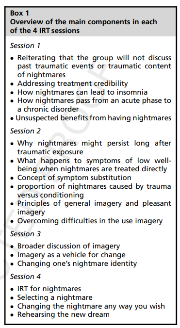

## Imagery Rehearsal Therapy

### Imagery Rehearsal Therapy: Principles and Practice

doi: [https://doi.org/10.1016/j.jsmc.2010.01.004](https://psycnet.apa.org/doi/10.1016/j.jsmc.2010.01.004)

**abstract**

> A significant proportion of individuals having been exposed to a traumatic event will experience trauma-related nightmares and approximately 5% to 8% of the general population also report problems with nightmares. Chronic nightmares may represent a primary sleep disorder rather than a symptom of a psychiatric disorder, and direct targeting of nightmares is a feasible clinical approach to the problem. Many treatments for nightmares have been proposed, but there is much empirical support for cognitive-behavioral interventions such as imagery rehearsal therapy (IRT). This article details key components of IRT typically covered in 4 successive weekly therapy sessions and their underlying rationale. Particular attention is given to the importance of developing flexible applications based on variations in patients' needs and clinical history. (PsycINFO Database Record (c) 2017 APA, all rights reserved)

**applied areas**

> effectively relieves idiopathic, recurrent, PTSD-related forms of nightmares.

> children suffering from nightmares.

**process**

IRT can be conceptualized as a 2-component therapeutic process, each of which targets a distinct yet overlapping problem in the nightmare sufferer.
1. The first component is an educational/cognitive restructuring element, focused on helping the nightmare sufferer to <b>consider their disturbing dreams as a learned sleep disorder</b>, similar to psychophysiologic insomnia.
2. The second component is an imagery education/training element, which teaches patients who have nightmares about the nature of human imagery and <b>how to implement a specific set of imagery steps to decrease nightmares</b>.

The first 2 sessions encourage patients to recognize the effect of nightmares on their sleep by showing them how nightmares promote learned insomnia. They are offered the view that nightmares themselves may develop as a learned behavior. The final 2 sessions engage the nightmare sufferer to learn about the human imagery system, to monitor how this system operates, to appreciate the connections between daytime imagery and dreams, and to implement the specific steps of IRT (ie, selecting a nightmare, changing the nightmare into a new dream, and rehearsing the new dream).

Throughout the sessions, we never discount or ignore patients’ perspectives on triggering incidents perceived as the cause of their nightmares. This point is especially relevant for trauma survivors  with nightmares and for the meanings they associate with their disturbing dreams. Nevertheless, patients are shown how nightmares can be effectively treated without any discussion or emphasis  on previous traumatic events or non–sleep-related PTSD symptoms. <b>IRT is organized to minimize exposure therapy as an ingredient of the technique.</b>

>session 1
> 1. That is, disturbing dreams, by many accounts from the empirical and theoretic literature, may serve a function of <b>emotional adaptation to emotionally salient or traumatic events</b>.
> 2. Early after the trauma, nightmares might help to relive the experience and remember important details that might be meaningful to the survivor; the dreams might provide useful information for emotional processing, either spontaneously through dreaming, rapid eye movement sleep, or in collaboration with a therapist; and the nightmares might serve a survival function by motivating the individual to alter a behavior or some other aspect of their lifestyle to remain out of harm’s way.

> session 2
> 1. Nightmares are a learned behavior.
> 2. Most patients are locked into the idea that nightmares persist because trauma or other PTSD symptoms stick in their minds. 

> session 3
> 1. Imagery in the Process of Change
> 2. Rehearsing change with Imagery
> 3. Rebuild indentity

> session 4
> 1. Most people with nightmares following trauma eventually stop having them. One possibility for this shift is that over a few weeks to a few months, the nightmares gradually keep changing as if the dreams themselves were working out some aspect of the emotional turmoil generated by the trauma.

insights:

The latter issue is dispatched by stating that most people require time to <b>learn how to comfortably generate pleasant images</b>, but the interval is usually measured in weeks for most nightmare sufferers, compared with months for patients with more complex PTSD.

[Like what you do in RumiBlocks]

cons:

For these reasons, we remain highly suspect of techniques in which therapists or other members of a group treatment seek to impose or just suggest changes in the dream content. In our view, such an approach seems less empowering to the individual. Some patients change minutiae in the dream, whereas others develop a brand new story. In our view, it would not be surprising if an important active ingredient of IRT were shown to be the ability to reconnect with the natural human capacity to manipulate and change imagery in the mind’s eye, beyond the specific changes of content within the new dreams.

